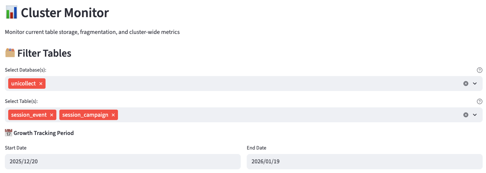
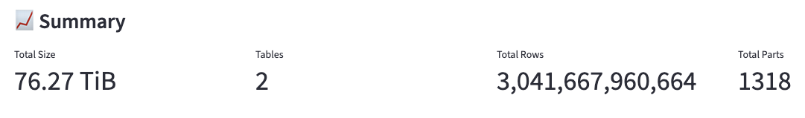
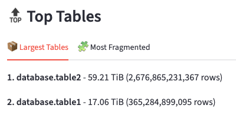
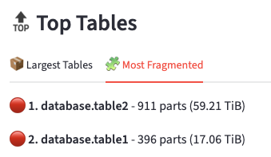
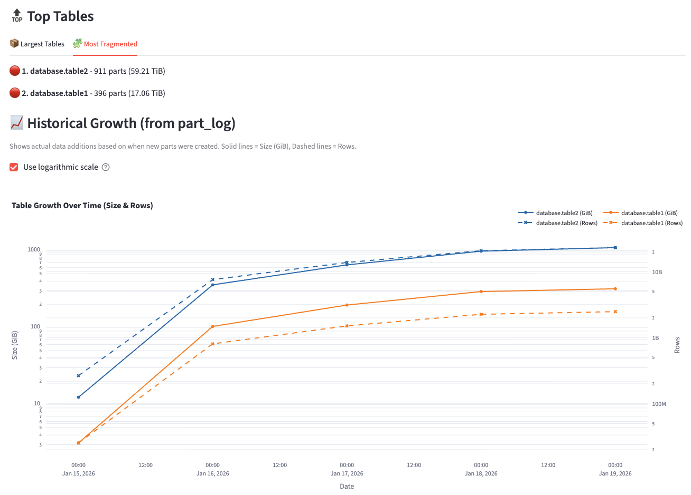
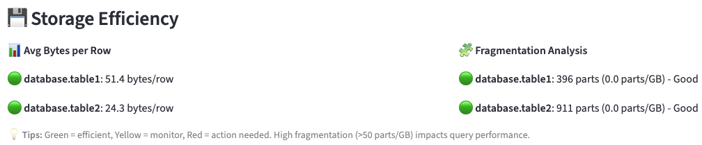
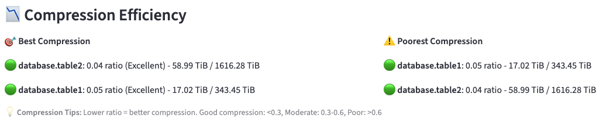

# Cluster Monitor Dashboard

This example demonstrates how to use the `Cluster Monitor` page in ClickForge Dashboard to monitor table storage, fragmentation, and compression efficiency across your ClickHouse cluster.

## Overview

The `Cluster Monitor` page helps you:

- Track total storage usage and table counts across your cluster
- Identify the largest or most fragmented tables
- Monitor table growth over time (size and rows)
- Analyze storage efficiency (bytes per row)
- Evaluate compression ratios and identify optimization opportunities

## Accessing the Page

Launch the dashboard:

```bash
uv run clickforge-dashboard
```

Then open http://localhost:8501 in your browser and navigate to `Cluster Monitor` in the sidebar.

## Configuration

Filter the analysis to specific databases and tables using the multi-select dropdowns. Select the date range for 
historical growth analysis. This data comes from ClickHouse's `system.part_log` table.



## Dashboard Sections

### Summary Metrics

After clicking **Generate Report**, you'll see high-level cluster metrics:

- **Total Size**: Combined storage across all selected tables
- **Tables**: Number of tables included in the analysis
- **Total Rows**: Sum of rows across all tables
- **Total Parts**: Sum of data parts (relevant for fragmentation analysis)



### Top Tables

Quick views of notable tables in two categories:

#### Largest Tables

The top 5 tables by storage size, showing size and row count.



#### Most Fragmented

The top 5 tables by parts count with color-coded indicators:
ok 
| Color | Parts Count | Status |
|-------|-------------|--------|
| 🟢 Green | ≤ 50 | Healthy |
| 🟡 Yellow | 51-100 | Monitor |
| 🔴 Red | > 100 | Action needed |



⚠️ Should evolve in a less static implementation in the future ⚠️

### Historical Growth

A dual-axis chart showing table growth over time from `system.part_log`:

- **Left Y-axis (solid lines)**: Size in GiB
- **Right Y-axis (dashed lines)**: Row count
- **Log scale**: Use the "Use logarithmic scale" checkbox to toggle between log and linear scale.

Each table gets a consistent color for both its size and row traces.



### Storage Efficiency

Two analyses to help optimize storage:

#### Bytes per Row

Shows average bytes consumed per row for each table. Color codes:

| Color | Bytes/Row | Interpretation |
|-------|-----------|----------------|
| 🟢 Green | < 100 | Very efficient - well-optimized schema |
| 🟡 Yellow | 100-500 | Moderate - typical for most tables |
| 🔴 Red | > 500 | Review schema - consider optimization |

**Optimization tips for high bytes/row:**
- Review column types (use smaller types where possible)
- Consider using `LowCardinality` for low-cardinality string columns
- Check for nullable columns that could be non-nullable. See [Den Crane's feedback](https://gist.github.com/den-crane/e43f8d0ad6f67ab9ffd09ea3e63d98aa).

#### Fragmentation Analysis

Measures fragmentation as **parts per GiB**. Color codes:

| Color | Parts/GiB | Recommendation |
|-------|-----------|----------------|
| 🟢 Green | ≤ 20 | Well optimized |
| 🟡 Yellow | 21-50 | Consider optimization |
| 🔴 Red | > 50 | `OPTIMIZE TABLE` recommended |



**Why fragmentation matters:**
- More parts = more files to read during queries
- High fragmentation degrades query performance
- Background merges eventually consolidate parts, but heavy write loads can outpace merging

### Compression Efficiency

Analyzes how well your data compresses. The **compression ratio** is calculated as:

```
compression_ratio = compressed_bytes / uncompressed_bytes
```

Lower ratios indicate better compression.

#### Color Codes

| Color | Ratio | Interpretation |
|-------|-------|----------------|
| 🟢 Green | < 0.3 | Excellent compression (70%+ space savings) |
| 🟡 Yellow | 0.3-0.6 | Good compression (40-70% space savings) |
| 🔴 Red | > 0.6 | Poor compression - review codec settings |



**Improving compression:**
- Use appropriate codecs: `ZSTD` for general use, `LZ4` for speed, `Delta` + `ZSTD` for timestamps
- Sort by high-cardinality columns in `ORDER BY` to improve compression
- Use `LowCardinality` for strings with few unique values
- Consider `DoubleDelta` codec for monotonically increasing values

## Use Cases

### Capacity Planning

1. Generate a report for all databases
2. Check the summary metrics for current usage
3. Review the growth chart to project future storage needs
4. Identify tables growing fastest for targeted optimization

### Performance Troubleshooting

1. Filter to databases/tables related to slow queries
2. Check fragmentation scores - high fragmentation impacts query speed
3. Review compression ratios - poorly compressed data means more I/O
4. Look at bytes/row for schema optimization opportunities

### Storage Optimization

1. Identify tables with poor compression (ratio > 0.6)
2. Find highly fragmented tables (> 50 parts/GiB)
3. Run `OPTIMIZE TABLE <name> FINAL` for fragmented tables
4. Consider schema changes for tables with high bytes/row

## Troubleshooting

### No Data Displayed

- Verify your ClickHouse connection in `~/.clickforge/clickhouse.yaml`
- Check that you have access to `system.parts` and `system.part_log` tables
- Ensure the selected databases/tables exist

### Growth Chart Empty

- The growth chart uses `system.part_log` which may have limited retention
- Try expanding the date range
- Verify `part_log` is enabled in your ClickHouse configuration

### Missing Compression Data

- Compression metrics require access to `system.parts` columns
- Some ClickHouse versions may have different column names

## Additional Resources

- [ClickHouse Parts Documentation](https://clickhouse.com/docs/en/operations/system-tables/parts)
- [ClickHouse Compression Codecs](https://clickhouse.com/docs/en/sql-reference/statements/create/table#column-compression-codecs)
- [OPTIMIZE TABLE Statement](https://clickhouse.com/docs/en/sql-reference/statements/optimize)
- [ClickForge Documentation](../../README.md)
