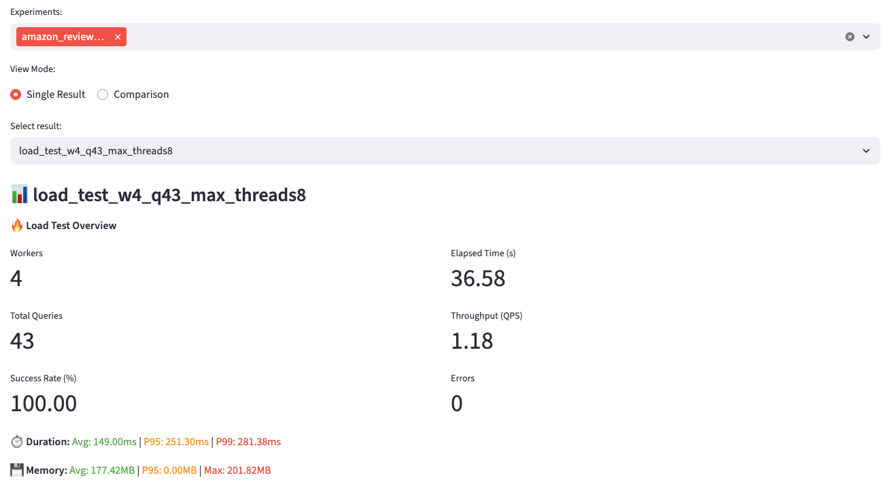
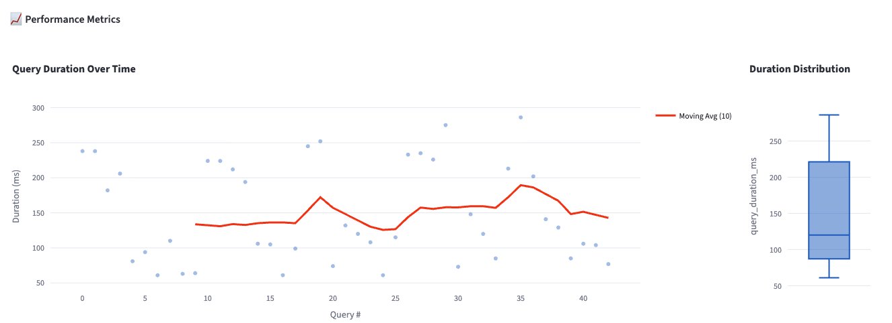
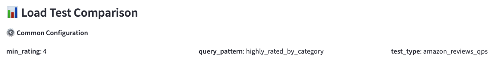
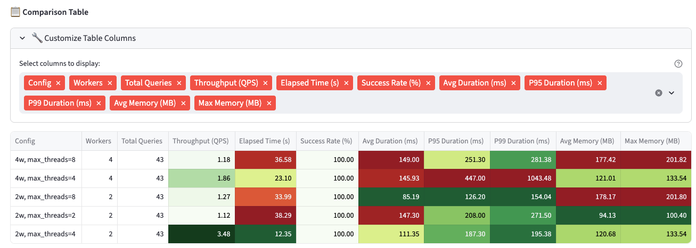
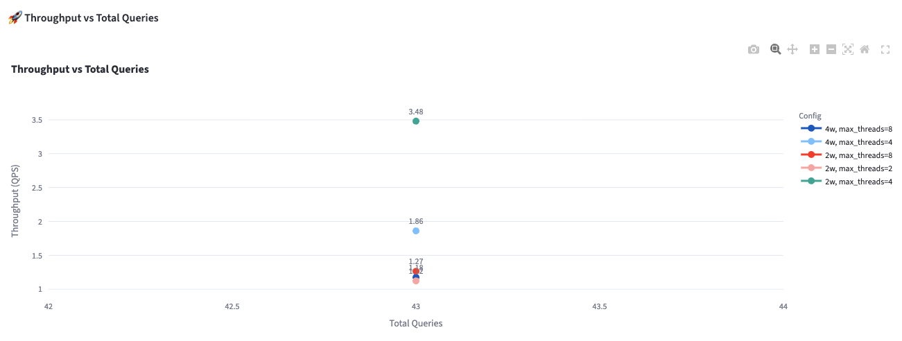
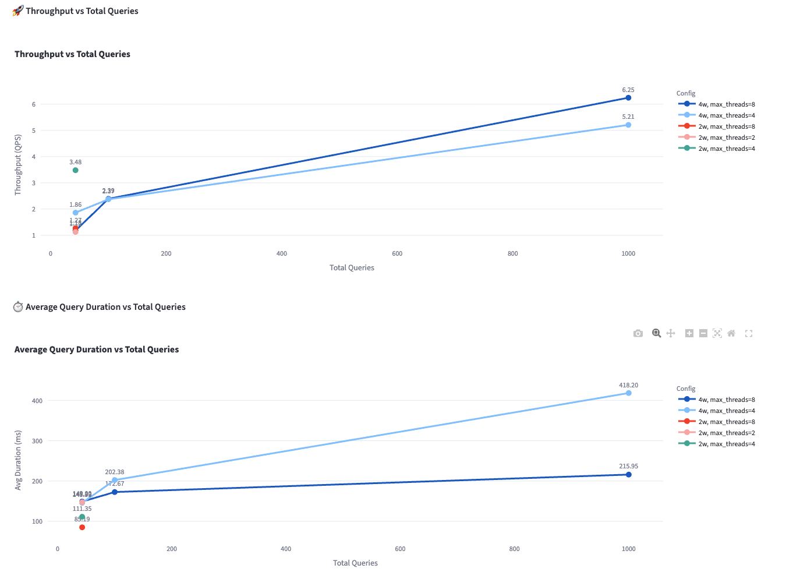

# Amazon Reviews QPS Test Example

This example demonstrates how to use ClickForge to test query performance across multiple product categories using the 
public [Amazon Reviews dataset](https://clickhouse.com/docs/getting-started/example-datasets/amazon-reviews).

## Overview

This load test benchmarks a query that retrieves highly-rated products (rating > 4) from different product categories. 
The test:

- Executes the same query 43 times (there are **43 different product categories**)
- Uses ClickHouse [query parameters](https://clickhouse.com/docs/sql-reference/syntax#defining-and-using-query-parameters) to substitute product category
- Tests query throughput and latency under concurrent load (43 queries in total here for demonstration purposes)
- Stores results in ClickHouse for analysis in the dashboard

## What You'll Learn

- How to set up parameterized load tests with multiple variations
- How to compare results across different configurations

## Test Configuration

The test configuration is defined in [amazon_reviews_qps_test.yaml](amazon_reviews_qps_test.yaml).

### Key Configuration Elements

**Query Template** ([amazon_reviews_query.sql](amazon_reviews_query.sql)):
```sql
SELECT
  product_id,
  product_title,
  product_category,
  star_rating,
  helpful_votes,
  total_votes,
  review_date
FROM clickforge.amazon_reviews
WHERE product_category = {product_category: String}
  AND star_rating > 4
ORDER BY helpful_votes DESC
LIMIT 100
```

**Parameters**: The test runs the query once for each of 43 product categories:
- Electronics
- Books
- Video Games
- Beauty
- Kitchen
- ... and 38 more

**Workers**: Configure how many parallel workers execute queries (default: 4)

**Settings**: ClickHouse query settings like `max_threads: 4`

**Labels**: Metadata tags for organizing results (`test_type`, `query_pattern`, `min_rating`)

## Running the Test

### 1. Execute the Load Test

From the project root:

```bash
uv run clickforge --experiment=examples/load-test/amazon_reviews_qps_test.yaml --experiment-name=amazon_review_qps
```

You'll see output showing:
- Query execution progress
- Success/error counts
- Total elapsed time
- Throughput (QPS)

### 2. Launch the Dashboard

```bash
uv run clickforge-dashboard
```

Open http://localhost:8501 in your browser.

## Analyzing Results

### Single Result View

Navigate to **Load Test Results** in the dashboard sidebar and select your experiment.

#### Load Test Overview

The overview shows key metrics about a given test in the experiment:



- **Workers**: Number of parallel workers (4 in this example)
- **Total Queries**: Total number of queries executed (43 - one per category)
- **Success Rate**: Percentage of successful queries
- **Elapsed Time**: Total time to complete all queries
- **Throughput (QPS)**: Queries per second achieved
- **Errors**: Number of failed queries

The overview also displays aggregated performance metrics:
- **Duration**: Average, P95, and P99 query duration in milliseconds
- **Memory**: Average, P95, and max memory usage in MB
- **Rows**: Average number of rows read per query



This scatter plot with a moving average helps you identify:
- Performance consistency across different categories
- Any outliers (queries that took unusually long)
- Trends over time (does performance degrade?)

### Comparison View

You can run multiple tests with different configurations and compare them in the dashboard (e.g., different worker 
counts or ClickHouse settings). For this you need to switch to **Comparison** mode.

#### Common Configuration

The dashboard automatically identifies settings that are identical across all selected experiments and displays them at the top:



#### Comparison Table

The comparison table shows key metrics side-by-side:



**Features:**
- **Color-coded performance**: Green for better values (higher throughput), red for worse values (higher latency)
- **Customizable columns**: Click "🔧 Customize Table Columns" to show/hide specific metrics
- **Config column**: Shows only the settings that vary between runs

#### Performance Charts

Compare how different configurations perform:



This chart shows:
- **X-axis**: Total queries executed (useful when comparing different numbers of queries in the load)
- **One line per configuration**: Each worker count or setting variation gets its own line
- **Data labels**: Exact values displayed on each point

Similar charts are available for:
- Average, P95, and P99 query duration
- Average and max memory usage

## Understanding the Results

### What Makes a Good Result?

- **High throughput (QPS)**: More queries completed per second
- **Low latency**: Lower average, P95, and P99 duration
- **Consistency**: Small variance between min and max duration
- **100% success rate**: All queries completed successfully

### Common Patterns

**Linear scaling with workers**: Doubling workers should roughly double throughput (if not CPU/IO bound)

**Tail latencies (P95, P99)**: Pay attention to these - they represent the experience for your slowest users

**Memory usage**: Should remain consistent across queries if the result set size is similar

## Customizing the Test

### Change Worker Count

Edit `amazon_reviews_qps_test.yaml`:

```yaml
workers: 8  # Increase for more concurrency
```

### Modify Query Settings

Adjust ClickHouse-specific settings:

```yaml
settings:
  max_threads: 8  # More threads per query
  max_memory_usage: 10000000000  # 10GB limit
```

### Test on a Larger Sample of Categories

The basic test uses 43 categories (one per unique category in the dataset). To test with more queries, you can use 
ClickHouse as your parameter source to get multiple samples per category.

**Query to get unique categories:**
```sql
SELECT product_category
FROM clickforge.amazon_reviews
GROUP BY product_category
```

**For larger tests with repeated categories:**
```sql
SELECT product_category
FROM clickforge.amazon_reviews
LIMIT 100
```

This will give you 100 parameter sets, potentially repeating some categories. See [amazon_reviews_qps_large_test.yaml](amazon_reviews_qps_large_test.yaml) 
for a complete example using ClickHouse as a parameter source.

### Comparing Different Configurations

After running multiple tests with different settings in the same experiment, you can compare them side-by-side:



**Example insight:** This comparison shows that `max_threads=8` improves throughput for larger load tests (100+ queries 
with 4 workers), but `max_threads=4` performs better for smaller tests. This demonstrates how ClickHouse settings impact 
performance differently depending on workload size.

### Test Different Queries

Modify `amazon_reviews_query.sql` to test different query patterns:

```sql
-- Example: Test aggregation performance
SELECT
  product_category,
  COUNT(*) as review_count,
  AVG(star_rating) as avg_rating,
  SUM(helpful_votes) as total_helpful_votes
FROM clickforge.amazon_reviews
WHERE product_category = {product_category: String}
  AND star_rating > 4
GROUP BY product_category
```

## Troubleshooting

### "No load test experiments found"

- Make sure you ran the test with `clickforge --experiment ...` first
- Check that the results are being stored in your configured ClickHouse instance
- Verify your dashboard is connected to the same ClickHouse instance

### Connection Errors

- Verify your `~/.clickforge/clickhouse.yaml` configuration
- Test connectivity: `clickhouse-client --host your-host --port 8123`
- For GCP Secret Manager, ensure you're authenticated: `gcloud auth application-default login`

### Low Throughput

- Check ClickHouse server resources (CPU, memory, disk I/O)
- Verify the `amazon_reviews` table is properly indexed
- Try different `max_threads` settings
- Consider the network latency between ClickForge and ClickHouse

## Additional Resources

- [ClickHouse Query Settings](https://clickhouse.com/docs/en/operations/settings/query-complexity)
- [ClickHouse Performance Optimization](https://clickhouse.com/docs/en/operations/performance)
- [ClickForge Documentation](../../README.md)