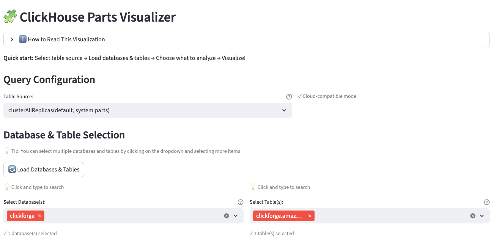
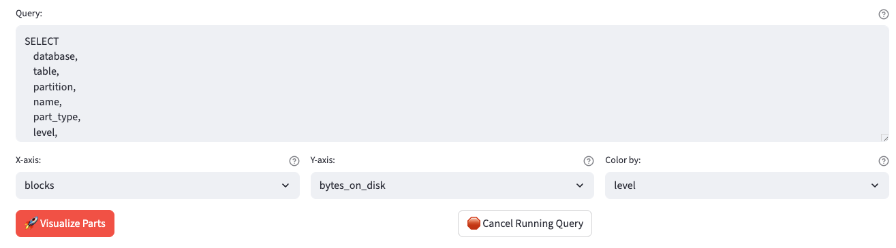

# Parts Visualizer

This page provides an interactive visualization of ClickHouse table parts, helping you understand data distribution, merge activity, and storage efficiency.

## Overview

The Parts Visualizer helps you:

- Visualize table parts as rectangles showing their size and position
- Understand merge activity through level indicators
- Identify fragmentation (many small parts vs. few large merged parts)
- Analyze storage distribution across partitions
- Monitor part health and merge progress

## Accessing the Page

Launch the dashboard:

```bash
uv run clickforge-dashboard
```

Then open http://localhost:8501 in your browser and navigate to `Parts Visualizer` in the sidebar.

## Configuration

### Table Source

Choose the data source for parts information:

| Source | Use Case |
|--------|----------|
| `system.parts` | Direct access to local ClickHouse instance |
| `clusterAllReplicas(default, system.parts)` | ClickHouse Cloud or distributed clusters |

The cluster mode is selected by default for compatibility with ClickHouse Cloud.

### Database & Table Selection

Click **Load Databases & Tables** to fetch available databases and tables from your ClickHouse instance.



- Select one or more databases from the dropdown
- Select specific tables to analyze
- The query is automatically generated based on your selection

### Visualization Options

Configure how parts are displayed:



| Option | Description |
|--------|-------------|
| **X-axis** | Metric for horizontal positioning (blocks, bytes_on_disk, rows) |
| **Y-axis** | Metric for vertical positioning - uses log scale (bytes_on_disk, data_compressed_bytes, etc.) |
| **Color by** | Metric for color coding (level, blocks, rows, bytes) |

## Understanding the Visualization


### How to Read the Rectangle Chart

Each **rectangle** represents one table part (a file containing data):

#### Horizontal Position (X-axis)

- Parts are placed **left to right** in creation order
- The **left edge** = cumulative sum up to that part
- The **width** = that part's contribution to the total
- Example: If X-axis = "blocks", a part with 1000 blocks appears as a 1000-unit-wide rectangle

#### Vertical Position (Y-axis)

- The Y-axis value represents the **size** of each part
- Uses a **log scale** so both tiny (1 KB) and huge (1 TB) parts are visible
- Rectangle height is proportional to the Y value for visibility
- Bigger Y values = bigger rectangles, helping spot large parts quickly

#### Color

- Color intensity shows the selected metric (e.g., merge level)
- Blue-to-red gradient: darker/redder = higher values

### Metrics Explained

| Metric | Description |
|--------|-------------|
| **blocks** | Range of block numbers this part covers (each INSERT creates new blocks) |
| **rows** | Number of data rows stored in this part |
| **bytes_on_disk** | Total disk space used (compressed data + indexes + metadata) |
| **data_compressed_bytes** | Just the compressed data size |
| **data_uncompressed_bytes** | Original uncompressed data size |
| **level** | Merge tree level - parts start at 0, each merge increases the level |

### What Patterns to Look For

| Pattern | Meaning |
|---------|---------|
| Many small parts | Inefficient - ClickHouse will merge them |
| Few large parts | Good - data has been merged |
| High level values | Part has been merged many times |
| Mixed sizes | Active table with ongoing merges |

## Summary Statistics

After visualization, expand the **Summary** section to see:

- **Total Parts**: Number of data parts in the partition
- **Total Rows**: Total rows across all parts
- **Total Bytes on Disk**: Total disk space used
- **Avg Merge Level**: Average merge tree level (higher = more merged)
- **Max Merge Level**: Highest merge level in the partition

The **Parts Details** table shows individual part information including name, type, level, and modification time.

## Advanced Features

### Custom Query

The generated SQL query can be modified directly in the text area. This allows you to:

- Add custom WHERE conditions
- Filter by specific partitions
- Limit the number of parts returned

### Cancel Running Query

If a query is taking too long, click **Cancel Running Query** to stop it on the ClickHouse server.

## Use Cases

### Monitor Merge Activity

Track how well ClickHouse is merging parts:

1. Select your table
2. Set Color = "level"
3. High-level parts (redder) indicate well-merged data
4. Many level-0 parts suggest recent inserts awaiting merge

### Identify Fragmentation

Find tables with too many small parts:

1. Set X-axis = "rows" and Y-axis = "bytes_on_disk"
2. Many narrow, short rectangles = fragmented table
3. Consider running `OPTIMIZE TABLE` if fragmentation is high

### Analyze Storage Distribution

Understand how data is distributed across partitions:

1. Select multiple partitions in your query
2. Compare rectangle sizes across partitions
3. Identify uneven data distribution

## Troubleshooting

### "No parts found matching the query"

- Verify the database and table exist
- Check that the table uses the MergeTree engine
- Ensure `active = 1` filter isn't excluding all parts

### Query Timeout

- Reduce the number of tables selected
- Add more restrictive WHERE conditions
- Use the Cancel button and try a smaller query

### Visualization Too Dense

- Filter to a single partition
- Add LIMIT clause to the query
- Select fewer tables
