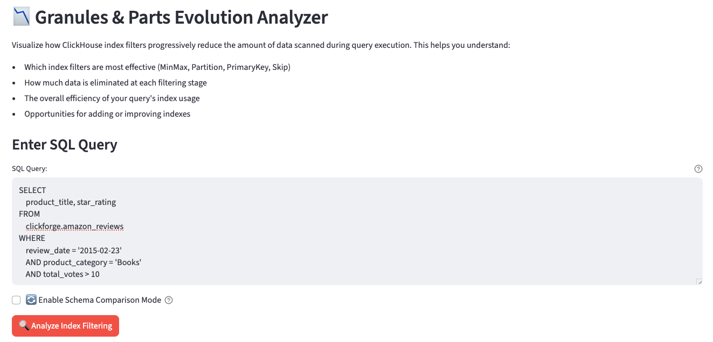
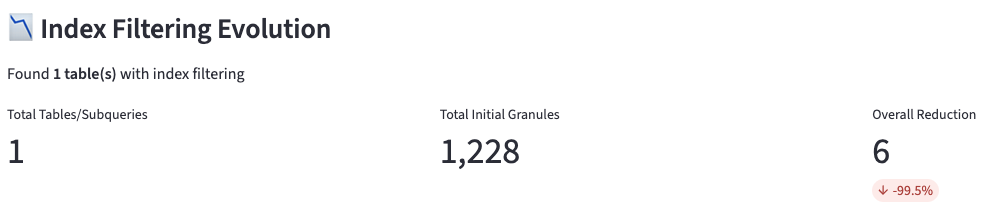
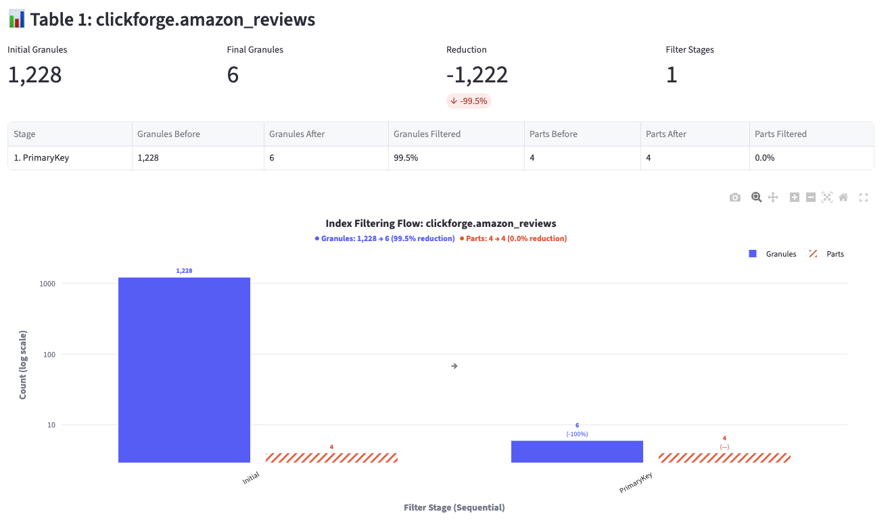
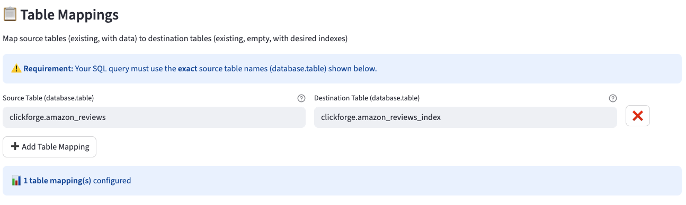
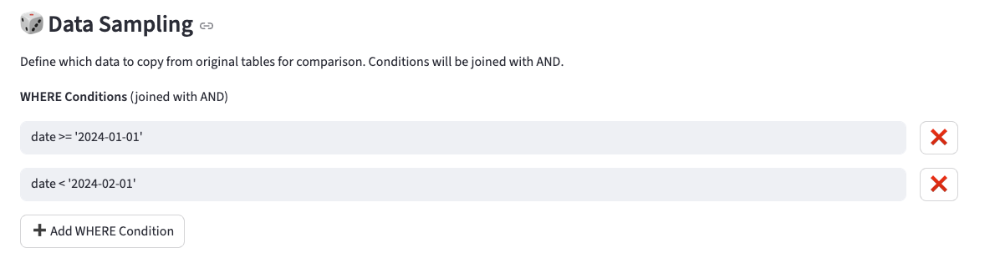
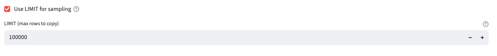
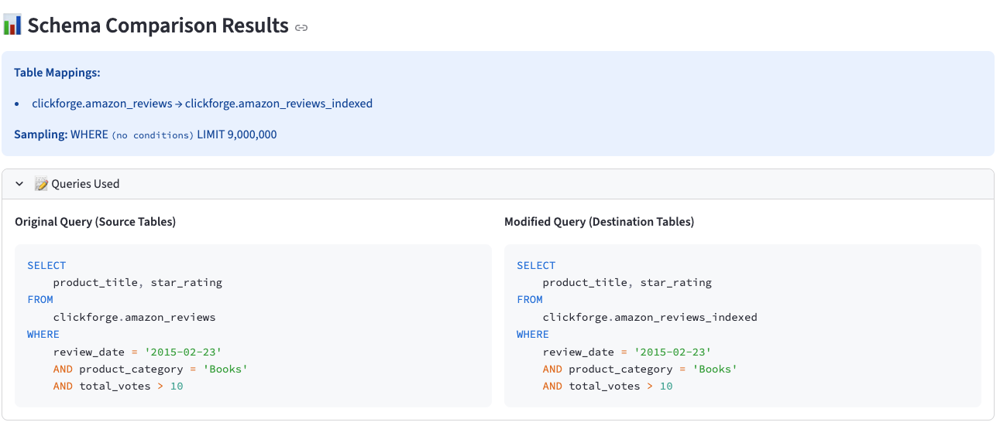
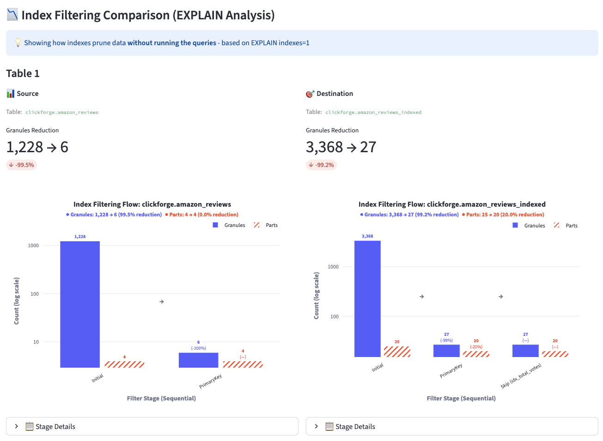

# Query Plan Viewer

This page demonstrates how to use the `Granules & Parts Evolution Analyzer` in ClickForge Dashboard to visualize how ClickHouse index filters progressively reduce the amount of data scanned during query execution.

## Overview

The Query Plan Viewer helps you:

- Visualize which index filters are most effective (MinMax, Partition, PrimaryKey, Skip)
- See how much data is eliminated at each filtering stage
- Understand the overall efficiency of your query's index usage
- Identify opportunities for adding or improving indexes
- Compare index performance between different table schemas

## Accessing the Page

Launch the dashboard:

```bash
clickforge-dashboard
```

Then open http://localhost:8501 in your browser and navigate to `Query Plan Viewer` in the sidebar.

## Basic Analysis Mode

### Enter Your Query

Paste any ClickHouse SQL query to analyze its index filtering behavior.



### Index Filtering Evolution

After clicking **Analyze Index Filtering**, you'll see:

- **Overall Summary**: Total tables analyzed, initial granules, and overall reduction
- **Per-Table Breakdown**: Each table's filtering stages with granules and parts counts



### Filtering Stages

The analyzer shows each filtering stage in sequence:

| Stage | Description |
|-------|-------------|
| **Initial** | Total granules/parts before any filtering |
| **MinMax** | Filtered by min/max values stored in part metadata |
| **Partition** | Filtered by partition key |
| **PrimaryKey** | Filtered by primary key (ORDER BY) |
| **Skip (index_name)** | Filtered by skip indexes (bloom_filter, minmax, etc.) |



### Understanding the Chart

The bar chart shows:

- **Blue bars**: Granules count at each stage
- **Red bars**: Parts count at each stage
- **Percentages**: Reduction from previous stage
- **Log scale**: Handles large differences between granules and parts

## Schema Comparison Mode

Enable **Schema Comparison Mode** to compare how different table schemas (with different indexes) prune data.

### Workflow

1. **Create destination table**: Pre-create an empty table with your desired indexes
2. **Configure table mapping**: Map source → destination tables
3. **Set sampling conditions**: Define WHERE conditions and LIMIT for data sampling
4. **Run comparison**: ClickForge samples data and compares EXPLAIN plans

### Table Mappings

Map your source tables (with data) to destination tables (empty, with desired indexes).



**Important**: Your SQL query must use fully qualified table names (`database.table`) that match the source table names in your mappings.

### Data Sampling

Configure how data is sampled from source to destination tables:

- **WHERE Conditions**: Multiple conditions joined with AND
- **LIMIT**: Maximum rows to copy (default: 100,000)



You can also set a row limit for sampling:



### Comparison Results

Side-by-side comparison showing:

- **Source Tables**: Original schema's index filtering
- **Destination Tables**: New schema's index filtering with additional indexes



The comparison chart shows both schemas side-by-side:



### Example: Testing a Skip Index

```sql
-- 1. Create destination table with a skip index
CREATE TABLE clickforge.amazon_reviews_indexed
(
    `review_date` Date,
    `marketplace` LowCardinality(String),
    `customer_id` UInt64,
    `review_id` String,
    `product_id` String,
    `product_parent` UInt64,
    `product_title` String,
    `product_category` LowCardinality(String),
    `star_rating` UInt8,
    `helpful_votes` UInt32,
    `total_votes` UInt32,
    `vine` Bool,
    `verified_purchase` Bool,
    `review_headline` String,
    `review_body` String,

    INDEX idx_total_votes total_votes TYPE minmax GRANULARITY 1
)
ENGINE = MergeTree
ORDER BY (review_date, product_category);

-- 2. Configure mapping in UI:
--    Source: clickforge.amazon_reviews
--    Destination: clickforge.amazon_reviews_indexed

-- 3. Run comparison with your query
SELECT * FROM clickforge.amazon_reviews
WHERE total_votes > 100
```

### Cleanup

After comparison, use the **Clear Results & Truncate Destination Tables** button to:
- Clear comparison results from session
- Truncate destination tables (removes sampled data)

## Use Cases

### Evaluate Skip Indexes

Compare query performance with and without specific skip indexes:

1. Create destination table with desired skip index
2. Run comparison to see granules reduction
3. Decide if the index provides sufficient benefit

### Test ORDER BY Changes

See impact of different primary key ordering:

1. Create destination table with new ORDER BY
2. Compare how queries filter with different key orders
3. Evaluate trade-offs for your query patterns

### Compare Index Strategies

Test different combinations of indexes:

1. Create multiple destination tables with different index configurations
2. Run comparisons for your typical queries
3. Choose the best strategy based on filtering efficiency

## Troubleshooting

### "No index filtering stages found"

- Query may not use indexes (e.g., scanning entire table)
- Table may not use MergeTree engine
- Query conditions don't match indexed columns

### "Source table not found in query"

- Ensure query uses fully qualified names (`database.table`)
- Names must exactly match table mapping configuration

### "Failed to substitute table name"

- This was a bug when destination table name contained source name as prefix
- Fixed in latest version - update your ClickForge installation

### Slow Sampling

- Reduce LIMIT for faster sampling
- Add more restrictive WHERE conditions
- Start with smaller samples (100K rows) and increase if needed

## Additional Resources

- [ClickHouse EXPLAIN Documentation](https://clickhouse.com/docs/en/sql-reference/statements/explain)
- [ClickHouse Skip Indexes](https://clickhouse.com/docs/en/optimize/skipping-indexes)
- [ClickHouse Primary Keys](https://clickhouse.com/docs/en/optimize/sparse-primary-indexes)
