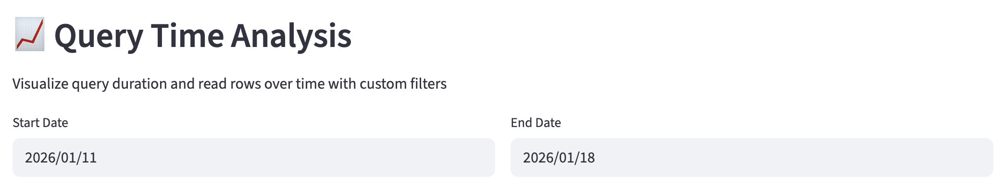
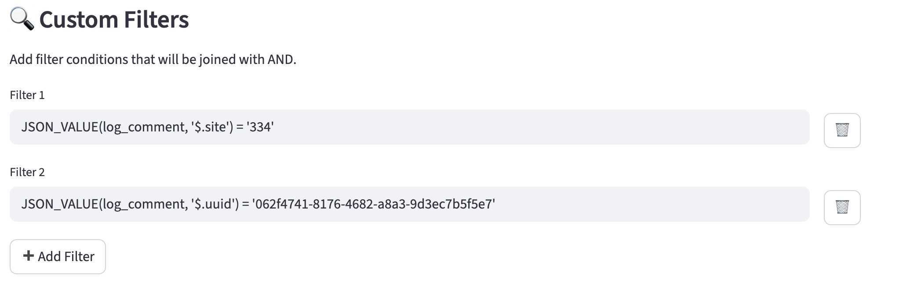
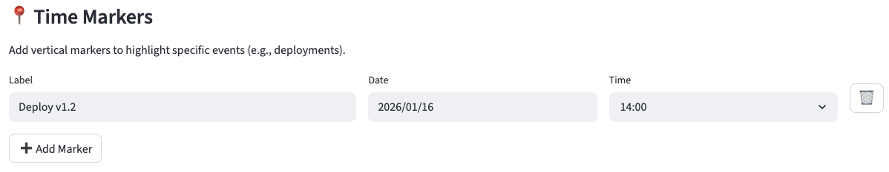
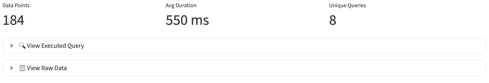
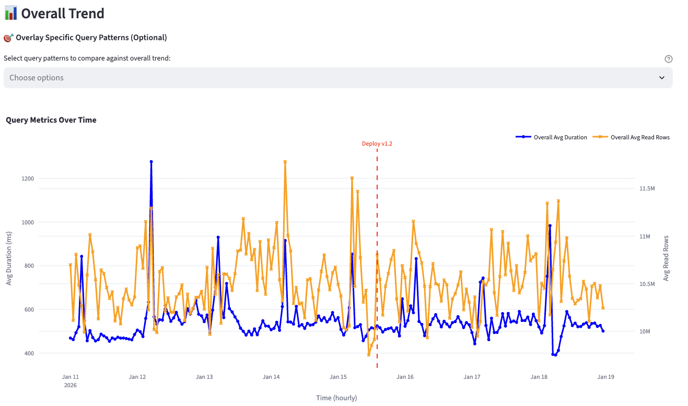
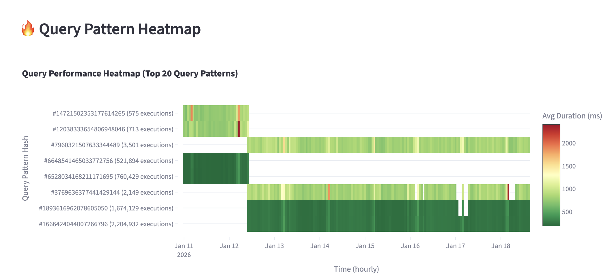
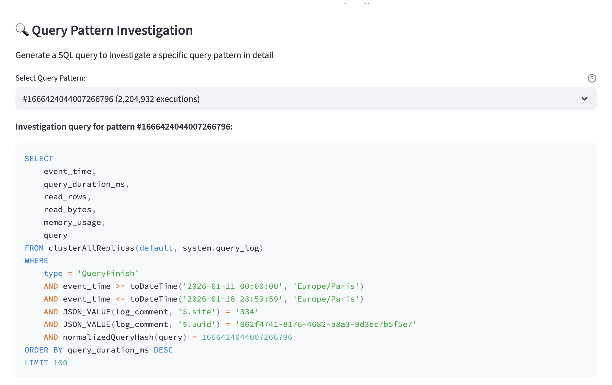

# Query Time Analysis Dashboard

This example demonstrates how to use the `Query Time Analysis` page in ClickForge Dashboard to visualize query 
performance metrics over time from your ClickHouse `system.query_log` table.

## Overview

The `Query Time Analysis` page helps you:

- Track query duration and rows read trends over time
- Use custom conditions to filter queries to monitor
- Identify slow query patterns (from [normalizedQueryHash](https://clickhouse.com/docs/sql-reference/functions/other-functions#normalizedQueryHash)) in a performance heatmap
- Compare specific query patterns against overall trends
- Generate investigation queries for deeper analysis

## Accessing the Page

Launch the dashboard:

```bash
uv run clickforge-dashboard
```

Then open http://localhost:8501 in your browser and navigate to `Query Time Analysis` in the sidebar.

## Configuration

### Time Range Selection

Select the date range for your analysis using the date pickers.



### Custom Filters

Add filter conditions to narrow down the queries you want to analyze. Filters are joined with `AND`.



Any column from `system.query_log` can be used in a filter condition.

### Time Markers

Add vertical markers to highlight specific events on the chart (e.g., deployments, incidents). A default example marker is shown to illustrate the feature. Each marker has:

- **Label**: A short description (e.g., "Deploy v1.2")
- **Date/Time**: When the event occurred

Use the ➕ button to add more markers. Only markers with non-empty labels are displayed on the chart.



## Analyzing Results

### Summary Metrics

After clicking **Generate Plots**, you'll see summary metrics:

- **Data Points**: Number of hourly time buckets with data
- **Avg Duration**: Overall average query duration in milliseconds
- **Unique Queries**: Number of distinct query patterns (by normalized query hash)



### Overall Trend Chart

A dual-axis line chart showing:

- **Avg Duration (ms)**: Blue line on the left y-axis
- **Avg Read Rows**: Orange line on the right y-axis

You can overlay specific query patterns to compare them against the overall trend:
- Select patterns from the dropdown
- They appear as dashed (duration) and dotted (rows) lines



### Query Pattern Heatmap

A heatmap showing the top 20 query patterns by execution count:

- **X-axis**: Time (hourly buckets)
- **Y-axis**: Query pattern hash with execution count
- **Color**: Average duration (green = fast, red = slow)

This helps identify:
- Which queries are consistently slow
- Performance variations over time
- Patterns that degrade during peak hours



### Query Pattern Investigation

Select a query pattern from the heatmap to generate a SQL query that shows:
- The 100 slowest executions of that pattern
- Full query text, duration, rows read, and memory usage

Copy this query to your ClickHouse client for detailed investigation.



## Use Cases

### Debugging Performance Regressions

1. Set the time range to span before and after a suspected regression
2. Add a time marker at the deployment time
3. Look for duration increases after the marker

### Identifying Slow Queries by User/Site

1. Add a filter like `JSON_VALUE(log_comment, '$.field') = '***'`
2. Generate the heatmap to find the slowest query patterns
3. Use the investigation query to see actual query examples

### Comparing Query Patterns

1. Generate the overall trend
2. Select specific query patterns to overlay
3. Identify patterns that deviate significantly from the overall average

## Troubleshooting

### No Data Displayed

- Verify your ClickHouse connection in `~/.clickforge/clickhouse.yaml`
- Check that `system.query_log` contains data for your time range
- Ensure your filters are valid SQL conditions

### Slow Loading

- Narrow the time range (query_log can be large)
- Add more specific filters to reduce the data scanned
- Check ClickHouse server resources

## Additional Resources

- [ClickHouse Query Log Documentation](https://clickhouse.com/docs/en/operations/system-tables/query_log)
- [ClickHouse JSON Functions](https://clickhouse.com/docs/en/sql-reference/functions/json-functions)
- [ClickForge Documentation](../../README.md)